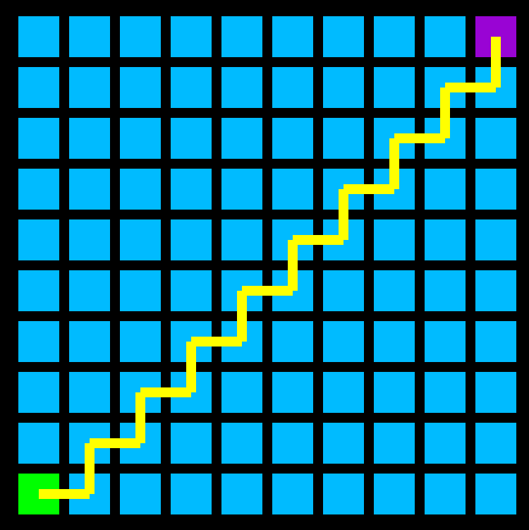

# **A-Star Pathfinder**

## **About**

This application performs the visual demonstration of the **A-Star** algorithm by using C++ and Modern OpenGL (ver 3.3). 

The application also including the examples of window handling with **GLFW**, Modern OpenGL concepts like **Vertex Shaders**, **Fragment Shaders**, **VAO's** (Vertex Array Objects), **VBO's** (Vertex Buffer Objects) and **EBO's** (Element Buffer Objects).

## **How to Use**

*  Use left mouse button to set **Start** point of algorithm
*  Use right mouse button to change current cell state to **Empty** or **Obstacle**
*  Use middle mouse button to set **Target** point of algorithm

